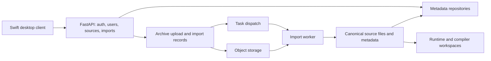

# Guardian Backend

**A recording-ingestion backend that turns uploaded archives into owned, indexed source files and per-user workspaces.**

Built by **Jackie Oliver** at Haptica. I built the ingestion/storage backend, source and user lifecycle, import workers, VM workspace integration, and native desktop client.

**Python · FastAPI · Pydantic · Firestore · Google Cloud Storage/Tasks · Swift/macOS**

## System boundaries



Firestore, Cloud Storage, Cloud Tasks, and SSH are deployment adapters. Tests substitute in-memory repositories, local object storage, and fake SSH so the core contracts can be exercised without a cloud account.

## Read the implementation

| Component | Responsibility |
| --- | --- |
| [API routes](src/guardianbackend/api) | Authentication boundaries and request/response contracts. |
| [Import service](src/guardianbackend/imports/service.py) | Import/shard state, upload coordination, and dispatch. |
| [Import worker](src/guardianbackend/imports/worker.py) | Archive manifests, extraction, canonical object materialization, and source-file registration. |
| [Files](src/guardianbackend/files) | File metadata, identity, and time inference. |
| [Storage adapters](src/guardianbackend/storage) | Object paths and local/cloud storage behavior. |
| [VM services](src/guardianbackend/vm) | User workspace bootstrap, access, and compiled-output synchronization. |
| [Desktop client](apps/GuardianDesktop/Sources) | Import workflow, source inventory, archive views, and journal terminal. |
| [Contract tests](tests) | Import worker behavior, user isolation, tokens, source lifecycle, and workspace synchronization. |

## Why it is structured this way

- **Uploads and processing have different lifecycles.** An import is recorded and dispatched separately from extraction, so request handling does not need to wait for all archive processing.
- **Transport layout is not canonical storage.** A manifest describes files inside an archive; the worker registers their source metadata and materializes the canonical objects used downstream.
- **Ownership travels with metadata.** User/source/import identifiers connect a file to the correct account and workspace.
- **Infrastructure has replaceable boundaries.** Repository, storage, task, and SSH abstractions support focused tests while retaining real deployment adapters.
- **Derived work needs a return path.** Compiler/runtime sync code supports moving approved sources into workspaces and compiled metadata back into the backend.

## Run the offline suite

Requires Python 3.12+ and `uv`:

```sh
uv sync --frozen
uv run pytest -q
```

**35 tests passed on October 6, 2026**, including synthetic archive ingestion and fake-SSH workspace tests. No production database or cloud resources were used.

For local API development, inspect [settings](src/guardianbackend/config/settings.py) and [dependency wiring](src/guardianbackend/api/deps.py) before configuring adapters. Production credentials and deployment settings are deliberately absent. The container definition is included for review; this edition does not provision a cloud deployment.

The macOS client uses the checked-in [XcodeGen definition](apps/GuardianDesktop/project.yml), macOS 15+, and external Swift packages. Supply your own OAuth client IDs and signing settings. The original bundled Bravura font and account-specific configuration are omitted. Native UI and live cloud/SSH integration were not revalidated during this publication pass.

See [publication scope](PUBLICATION.md). This is a code edition, with no customer/source archives or original private history.
